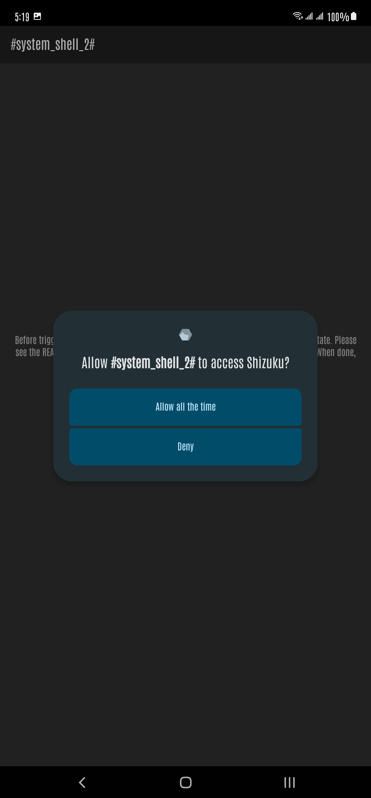
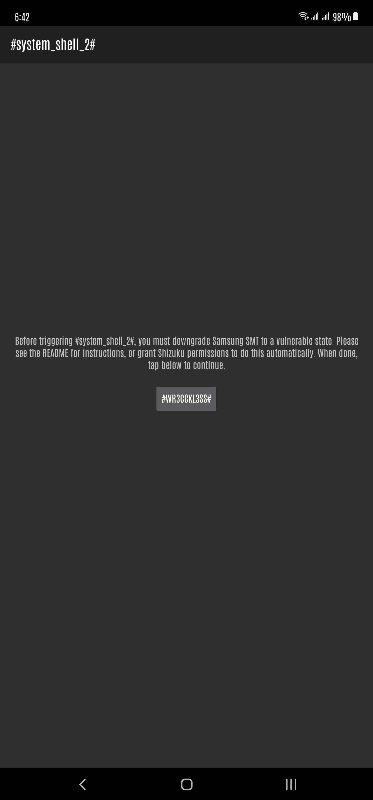
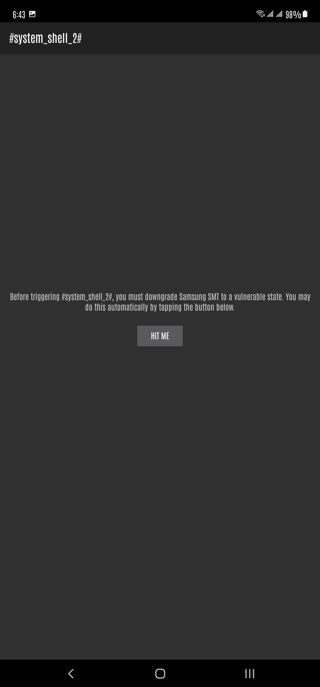
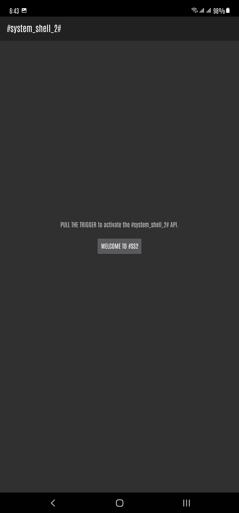
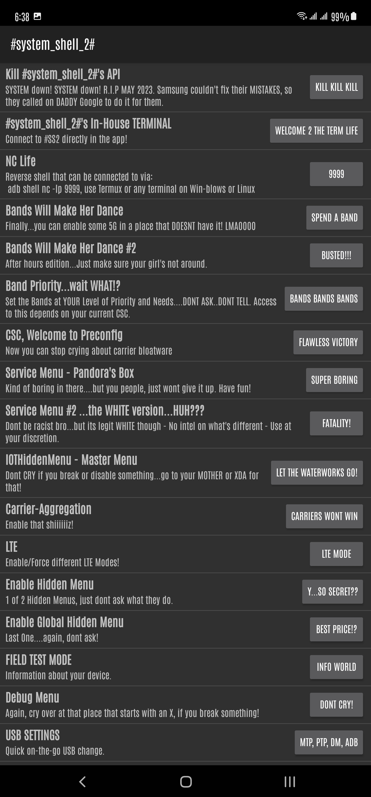
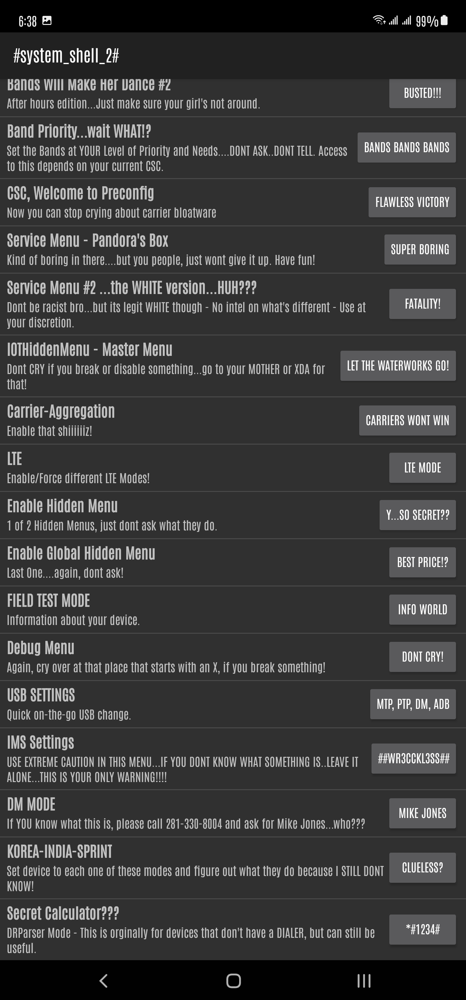

# #system_shell_2#

SMT Shell by BLuFeNiX with a twist of my own UPDATED & UPGRADED. #system_shell_2# will allow you to achieve a `system` shell (UID 1000). This was brought upon me as a challenge to update and upgrade SMT Shell. With the updates and upgrades implemented, you can NOW bypass Samsung's One UI 5.1 patch that was introduced back in Feb but strictly limited up to devices carrying the May 1,2023 security patch and on most watches, a security patch of April 1, 2023. This is something AOSP did to prevent any bypasses resulting in Samsung-text-to-talk being downgraded past the factory apk on your device. See here for more information  https://android.googlesource.com/platform/frameworks/base/+/33940a9749666eec991904094ccf56ae4ca4ae10


#system_shell_2# was kept almost intact except for the obvious changes. The majority of the buttins added, only work if your device carries IOTHiddenMenu. If you have a Korean or Indian variant, you MAY not be able to enjoy the full functionality that this version brings. There is nothing at the moment to change this or get it installed on your device. If you have IOTHiddenMenu already installed, then enjoy. If not, then your out of luck. 


<div align="center">
    
     
    
     
     
      
</div>
 


## Credits
    BLuFeNiX (https://github.com/BLuFeNiX/)

    SMTShell (https://github.com/BLuFeNiX/SMTShell/)

    SMTShell-API (https://github.com/BLuFeNiX/SMTShell-API/)

#### Thanks for the challenge and your patience. I still dont know what I'm doing but I'm getting there.


## *New* Bypass Method
The method for bypassing the One UI 5.1 was found by one individual. Full credit goes to him and his efforts on making this bypass available. Many thanks to k0mraid3 for his contribution. https://twitter.com/k0mraid3

#### The following is the command that bypasses the FEB patch but stops at MAY 2023.
```
adb install -d -i com.sec.android.preloadinstaller /data/local/tmp/com.samsung.SMT_v3.0.02.2.apk
pm install -d -i com.sec.android.preloadinstaller /data/local/tmp/com.samsung.SMT_v3.0.02.2.apk
```


## Usage (with Shizuku)

Simply run the app and grant Shizuku access.

## Usage (no Shizuku)

1. Downgrade the TTS app to [the version provided](https://raw.githubusercontent.com/BLuFeNiX/SMTShell/master/smtshell/app/src/main/assets/com.samsung.SMT_v3.0.02.2.apk) (this must be done after every reboot):
```
adb install -d com.samsung.SMT_v3.0.02.2.apk
```
Alternatively, you can use `pm install -d /data/local/tmp/com.samsung.SMT_v3.0.02.2.apk` if you copy the file to your device first, via `adb push`

2. Install and open the SMT Shell app, and follow the prompts.

## Licences & Origin

This project started as a fork of [SMT-CVE-2019-16253](https://github.com/flankerhqd/vendor-android-cves/tree/master/SMT-CVE-2019-16253), created by flankerhqd (AKA flanker017). There is also a write-up by flanker [here](https://blog.flanker017.me/text-to-speech-speaks-pwned). Due to the original repo containing multiple unrelated projects, this fork's git history was rewritten using `git filter-repo` so that it only contains the relevant code (and no prebuilt artifacts).

This repo will continue to use the LGPL license that the original used when this fork was created. Other embedded components are licensed as follows:

### Shizuku - Copyright (c) 2021 RikkaW

Some code was copied or adapted from the [Shizuku API](https://github.com/RikkaApps/Shizuku-API) demo project, which is distributed under the MIT License. Primarily, this includes files in `smtshell/app/src/main/java/com/samsung/SMT/lang/smtshell/shizuku`, and the hidden API class stubs in `smtshell/hidden-api-stub`. A copy of the license can be found [here](https://github.com/RikkaApps/Shizuku-API/blob/master/LICENSE).

### Samsung

This project includes an unmodified Samsung APK, at `./smtshell/app/src/main/assets/com.samsung.SMT_v3.0.02.2.apk`.

### Changes from the original

Please see the git commit history for a comprehensive list of changes. Essentially everything was changed, and only the original exploit research remains in spirit.
